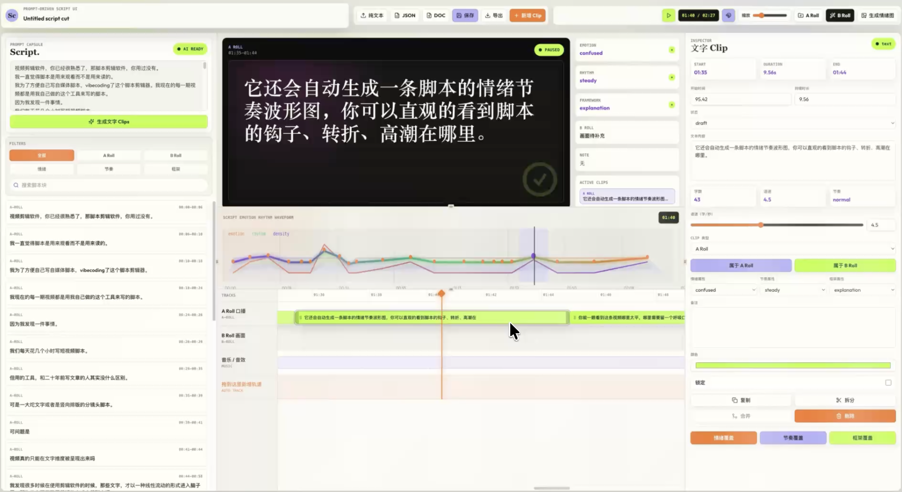
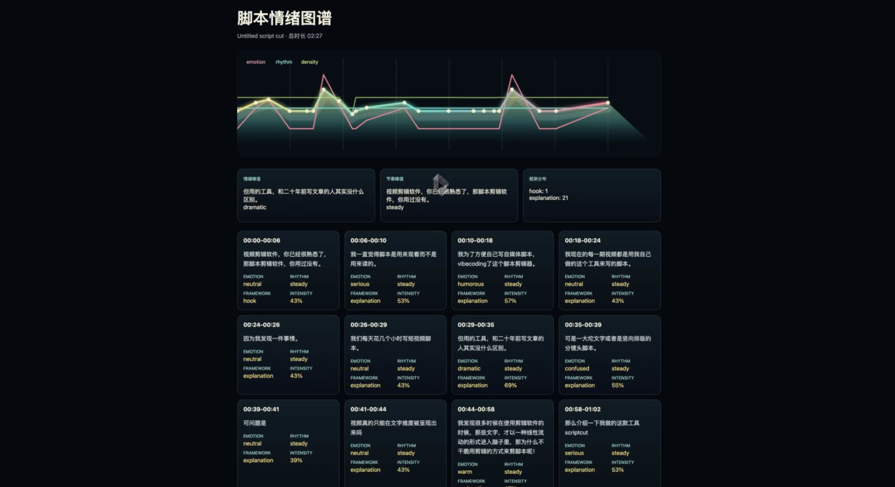

# Script Cut UI

Script Cut UI 是一个面向短视频口播创作者的脚本分析、A Roll / B Roll 分镜规划和导出工具。它把口播稿从「一段文字」变成可编辑的时间线：自动拆分文字 Clip、标注情绪和节奏、规划补画面、生成分镜，并导出可交付的 DOCX / XLSX 文件。

本项目基于 [DesignCombo React Video Editor](https://github.com/designcombo/react-video-editor) 改造而来。原项目提供了 React / Next.js 视频编辑器基础工程、Remotion 播放和多轨编辑能力；本仓库在此基础上新增了口播稿导入、自动情绪分析、脚本时间线、分镜规划、磁吸剪辑和文档导出能力。

## 项目截图

### 脚本剪辑工作台



### 脚本情绪图谱



## 适合谁

- 短视频口播创作者：把逐字稿拆成可剪辑、可规划的 A Roll 时间线。
- 自媒体剪辑师：根据口播内容快速补 B Roll、镜头建议和分镜列表。
- 内容策划和编导：用情绪、节奏、结构标签检查脚本推进是否顺畅。
- AI 视频工具开发者：把剪辑器、脚本分析和文档导出作为二次开发基础。

## 核心能力

- 口播稿导入：支持纯文本、Markdown、Word / HTML 文档。
- 自动切分 Clip：按句子和段落拆分 A Roll Clip，并自动估算时长。
- 情绪和节奏分析：自动标注 emotion、rhythm、framework、intensity 等脚本信息。
- 大模型 API 预留：可以接入任意 LLM 做更准确的语义、情绪和分镜分析。
- 多轨时间线：支持 A Roll、B Roll、音乐 / 音效轨道。
- Clip 编辑：支持拖动、跨轨道移动、左右拉伸、拆分、合并、复制、删除。
- 磁吸对齐：打开磁吸后，Clip 拖动时可以吸附到其他 Clip 边界和播放头。
- 音频播放：支持导入音频轨道并在播放时同步出声。
- 情绪图谱：生成脚本情绪、节奏和密度的可视化波形图。
- 文档导出：一键导出 A Roll 逐字稿、B Roll 分镜头列表和完整分镜脚本。

## 工作流

1. 导入口播稿，或直接粘贴脚本文本。
2. 点击生成文字 Clips，系统会自动拆分 A Roll。
3. 自动分析每个 Clip 的情绪、节奏、脚本结构和强度。
4. 在时间线中拖动、拉伸、拆分或合并 Clip。
5. 为口播段落补充 B Roll 画面、镜头说明和备注。
6. 需要对齐时打开磁吸按钮，快速对齐不同轨道的 Clip。
7. 导出 A Roll DOCX、B Roll XLSX、完整分镜 XLSX 或情绪图 HTML。

## 运行项目

```bash
pnpm install
pnpm dev -- --webpack -H 127.0.0.1 -p 3001
```

然后打开：

```text
http://127.0.0.1:3001/script-editor
```

如果本机没有 `pnpm`，也可以使用项目已有的本地 Next 可执行文件：

```bash
./node_modules/.bin/next dev --webpack -H 127.0.0.1 -p 3001
```

## 导出格式

| 导出项 | 文件类型 | 用途 |
| --- | --- | --- |
| A Roll | `*.a-roll-transcript.docx` | 口播逐字稿，可用于录制、校对和交付 |
| B Roll | `*.b-roll-shot-list.xlsx` | 补画面镜头列表，可交给剪辑师或素材团队 |
| 分镜脚本 | `*.storyboard.xlsx` | 完整分镜头脚本，包含口播、画面、镜头和节奏信息 |
| 全量脚本 | `*.full-script.docx` | 包含完整脚本内容的 Word 文档 |
| 情绪图 | `*.emotion-rhythm-map.html` | 脚本情绪、节奏和密度的可视化报告 |

## 大模型分析入口

当前自动情绪分析默认走本地规则，不依赖 API key。后续可以在这里接入任意大模型：

```text
src/features/script-editor/ai-script-analysis.ts
```

实现 `analyzeWithModelApi()`，返回与输入 segments 等长的 JSON 数组即可：

```ts
[
  {
    emotion: "curious",
    rhythm: "steady",
    framework: "hook",
    emotionalIntensity: 0.62,
    note: "模型分析说明",
    tags: ["auto-analysis"]
  }
]
```

如果模型 API 不可用，系统会自动回退到本地规则分析，保证导入口播稿后仍然可以生成基础情绪和节奏标注。

## 技术栈

- Next.js 16
- React 19
- TypeScript
- Remotion
- Zustand
- Radix UI
- Tailwind CSS
- DesignCombo editor packages
- `docx` for Word export
- Custom lightweight XLSX exporter

## 项目结构

```text
src/app/script-editor/page.tsx
src/features/script-editor/
  ai-script-analysis.ts
  analysis.ts
  components/
  exporters.ts
  script-parser.ts
  store.ts
  word-exporters.ts
  word-importers.ts
  xlsx-exporters.ts
```

## 开源来源说明

本项目是对 [DesignCombo React Video Editor](https://github.com/designcombo/react-video-editor) 的二次改造版本。请在发布、演示或再分发时保留原项目来源说明，并遵守原项目的许可证和版权声明。

原项目版权信息：

```text
Copyright © 2025 DesignCombo.
```

## License

请根据原项目许可证和你的再分发需求补充正式 LICENSE 文件。当前仓库保留原项目来源和版权声明。
